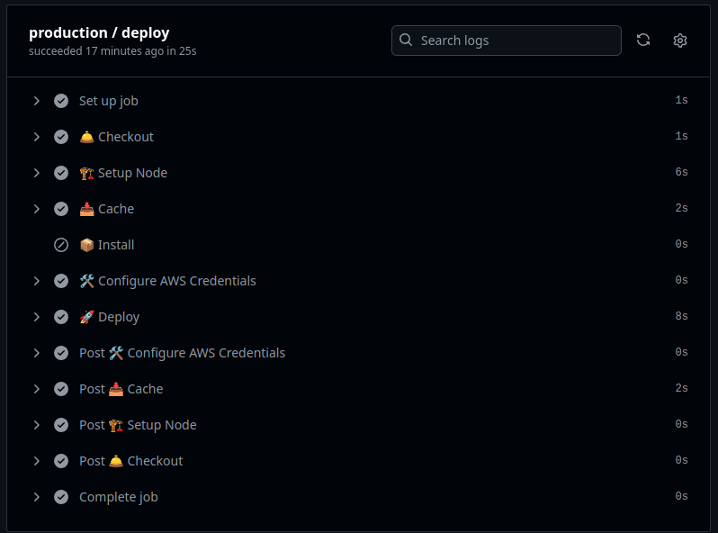
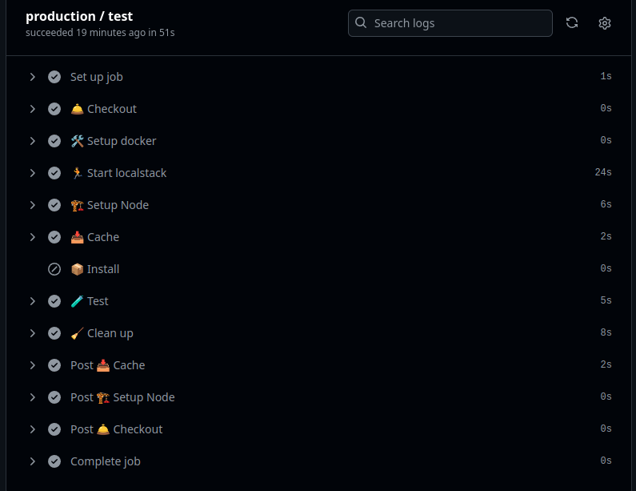
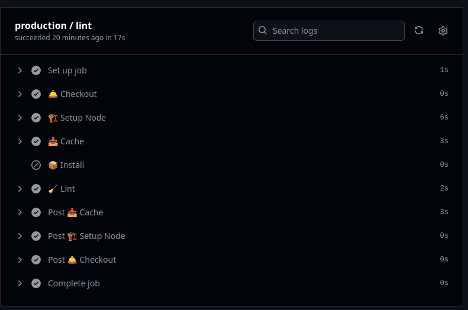
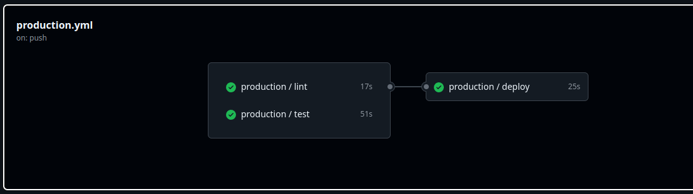

# Appointment Scheduling CRUD

This project provides a serverless CRUD application for managing appointment scheduling. It includes features like request validation, CI/CD pipelines, local testing with LocalStack, and comprehensive testing strategies.

## Table of Contents
- [Features](#features)
- [Prerequisites](#prerequisites)
- [Installation and Setup](#installation-and-setup)
- [Scripts](#scripts)
- [Testing](#testing)
- [CI/CD](#ci-cd)
- [Deployment](#deployment)
- [Local Testing](#local-testing)
- [Future Improvements](#future-improvements)


## Features

- Serverless Architecture: Built using the Serverless Framework for efficient resource management.

- Request Validation: Implements AWS Powertools Lambda Parser with Zod for robust request validation.

- Middleware: Utilizes Middy.js for streamlined middleware management.

- CI/CD with github actions: Automated deployments to sandbox and production environments, including all required resources.

- Testing: Includes both unit tests and integration tests leveraging LocalStack for DynamoDB.

- Local Development: Run and test the application locally using Docker and Makefile commands.

- Esbuild: Utilized as the bundler for efficient and fast Lambda function packaging, ensuring optimized deployment artifacts. This improves deployment performance by reducing package size and build times significantly, making the application ready for production environments with minimal overhead.

## Prerequisites

- Docker Compose: Required for running LocalStack locally.

- Node.js 20: Ensure you have Node.js 20 installed.

- AWS Account: Necessary for deploying to AWS. Set the required environment variables for AWS credentials before deployment.

## Installation and Setup

Clone the Repository:

```bash
  git clone <repository-url>
  cd <repository-name>
```

Install Dependencies:
```bash
  yarn install
```

Set Up LocalStack (Optional):

```bash
  docker-compose up -d
  yarn deploy:localstack
```

## Scripts

The following scripts are available in the package.json:

### Development

```bash
  yarn start: Start the application locally using Serverless Offline.

  yarn dev: Alias for yarn start.

  yarn deploy: Deploy the project (default stage).

  yarn remove: Remove the project (default stage).

  yarn deploy:dev: Deploy to the sandbox environment.

  yarn remove:dev: Remove from the sandbox environment.

  yarn deploy:prod: Deploy to the production environment.

  yarn remove:prod: Remove from the production environment.

  yarn deploy:localstack: Deploy to LocalStack.

  yarn remove:localstack: Remove from LocalStack.
```

### Testing

```bash
yarn test: Run all tests.

yarn test:unit: Run unit tests.

yarn test:integration: Run integration tests with LocalStack.
```

### Linting

```bash
  yarn lint: Run ESLint with auto-fix for code quality.
```

## CI-CD

The project includes CI/CD pipelines for the sandbox and production environments. These pipelines handle:

- **Deployments** of the application and required AWS resources.  
  

- **Automated execution** of unit and integration tests running on localstack.  
  

- **Linting** of code quality application.  
  

Below is an overview of the complete CI/CD pipeline:  


All workflows leverage a caching strategy for node_modules to optimize performance, reduce build times, and minimize redundant installations during CI/CD pipeline executions

## Makefile Commands

The Makefile provides commands for local testing and deployment:

- API Requests


```bash
  # Create Appointment: 
  make create-appointment

  # Delete Appointment:
  make delete-appointment

  # Get User Appointments:
  make get-user-appointments

  # Get Appointment Info:
  make get-user-appointment-info

  # Update Appointment:
  make update-user-appointment

  # Deployment
  Start Local Development:
  make start-dev

  # Deploy to LocalStack:
  make deploy-localstack

  # Deploy to Sandbox:
  make deploy-dev

  # Deploy to Production:
  make deploy-prod
```

## Testing

The project includes comprehensive testing strategies:

Run with:

```bash
# Unit Tests:
yarn test:unit


# Integration Tests:
yarn test:integration
```

## Deployment

To deploy the application:

```bash
# Sandbox Environment:
yarn deploy:dev

# Production Environment:
yarn deploy:prod

# LocalStack:
yarn deploy:localstack
``` 
Make sure your AWS credentials are correctly set for deployments to sandbox or production.

## Local Testing

You can test the API locally using the commands in the Makefile. Set the environment variables in the Makefile as needed:
```bash 
API_URL=http://localhost:3000/dev
USER_ID=test-user
APPOINTMENT_ID=45fc29c7-3ebc-42a8-b416-72cc47da39d9
```

Then execute any of the following:

```bash
make create-appointment

make get-user-appointments

# change APPOINTMENT_ID with value returned previous in create command
make get-user-appointment-info
make delete-appointment
make update-user-appointment

```

## Future Improvements

Here are some features and enhancements that could be implemented to further improve the project:

### 1. Reminder Scheduling with EventBridge and Lambda

*Description:* Implement a mechanism to schedule reminder messages for upcoming appointments using Amazon EventBridge and AWS Lambda.

How it Works:

Use EventBridge to create rules that trigger a Lambda function based on the appointment's reminderMinutesBefore value.

The Lambda function can send reminder notifications (e.g., via email or SMS) to users before their appointment time.

This approach ensures scalability and precise scheduling without manual intervention.

### 2. Authentication with JWT

Description: Introduce user authentication to improve security and simplify API usage.

How it Works:

Implement JWT-based authentication.

Once authenticated, users receive a token containing their user ID and permissions.

The user ID would no longer need to be passed in the URL for every request, as it could be extracted directly from the JWT.

This adds a layer of security and ensures users can only access their own data.

### 3. Routine for Database Cleanup

Description: Add a routine to clean up old data or automatically update appointments with past dates.

How it Works:

Create a scheduled Lambda function using EventBridge that runs daily or hourly.

The function scans for appointments where the date is in the past and updates their status to "DONE".

Optionally, appointments older than a specific threshold (e.g., 6 months) could be archived or deleted to optimize database usage.

These improvements can enhance the functionality, security, and maintainability of the system, making it more robust and user-friendly.